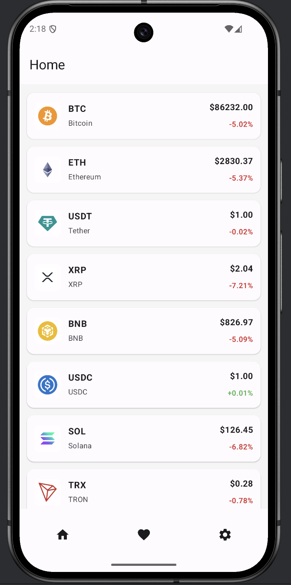
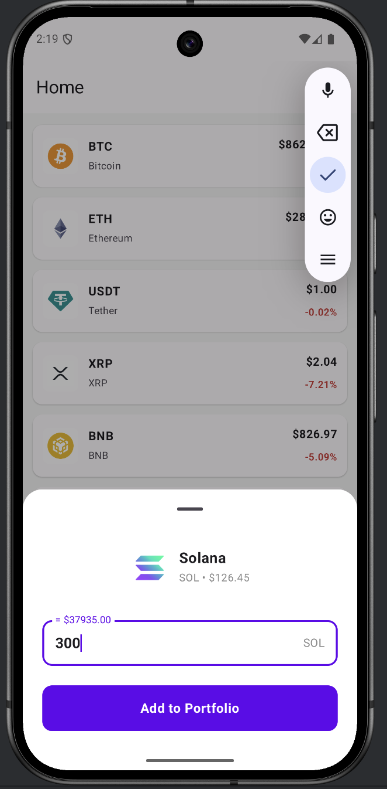
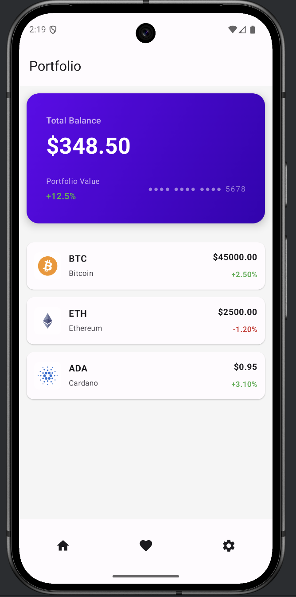
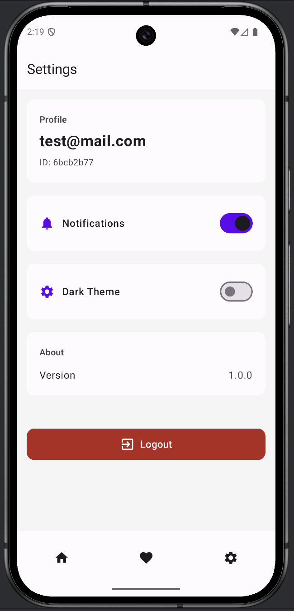

# Crypto App

An Android application for tracking cryptocurrencies with portfolio management capabilities.

## Screenshots

| | |
|---|---|
|  |  |
|  |  |

## Tech Stack

- **Kotlin** - Programming language
- **Jetpack Compose** - Modern UI framework
- **Retrofit** - HTTP client for API
- **Supabase** - Authentication and Database
- **CoinGecko API** - Cryptocurrency data
- **Room** (if used) - Local storage
- **Flow/StateFlow** - Reactive programming

## Architecture

The project is built on **Clean Architecture** with separation into three layers:

```
├── data/           # Data layer (repositories, API, DB)
├── domain/         # Business logic (use cases)
└── ui/             # User interface (Compose)
```

### Layer Structure

**Data Layer:**
- `api/` - API services (CoinGecko, Supabase)
- `repository/` - Repository implementations

**Domain Layer:**
- `usecase/` - Business logic (GetCoinsUseCase, LoginUseCase, etc)

**UI Layer:**
- `screens/` - Application screens
- `viewmodel/` - ViewModels for state management
- `component/` - Reusable components
- `theme/` - Design system

**DI:**
- `AppContainer` - Dependency injection container

## Features

- 📱 Authentication (registration/login)
- 📊 View cryptocurrency rates
- 💼 Portfolio management
- 🎨 Light/dark theme
- ⚙️ User settings


## Installation

1. Open the project in Android Studio
2. Sync Gradle
3. Add API keys for Supabase in `local.properties`
4. Run on emulator or device
